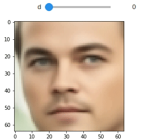

# CLEANIR: Controllable Attribute-Preserving Natural Identity Remover
This is the official implementation of [CLEANIR: Controllable Attribute-Preserving Natural Identity Remover](https://www.mdpi.com/2076-3417/10/3/1120)

## Requirements
- face-recognition>=1.2.3
- opencv-python>=4.1.0.25
- Keras>=2.2.4
- tensorflow-gpu>=1.13.0rc0+nv
- matplotlib>=3.0.2
- numpy>=1.14.5
- pandas>=0.23.0
- tqdm>=4.32.2
- gdown>=3.10.2
- keras-facenet>=0.1a5 (if you want to run codes for evaluation on de-identification)
- azure-cognitiveservices-vision-face>=0.4.0 (if you want to run codes for evaluation on preserving facial emotion)

### Testing environment
- Ubuntu 16.04
- Python 3.5.2
- Keras 2.2.4 (backend=TensorFlow 1.13.0-rc0)

## Usage
Please check CLEANIR_notebook.ipynb
